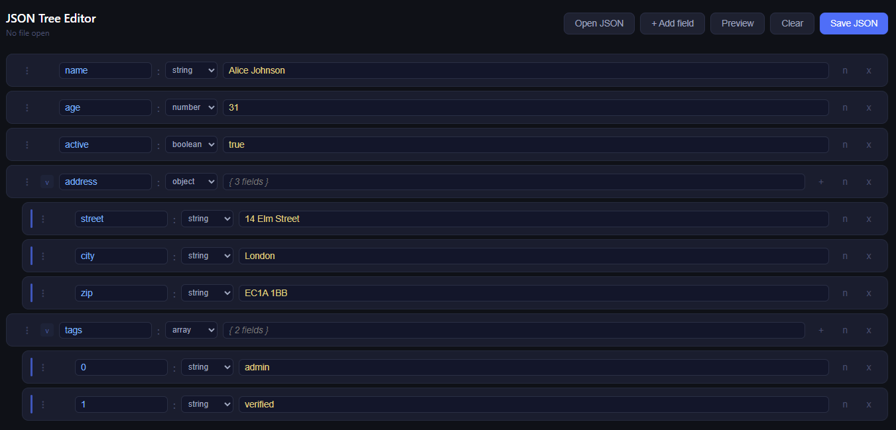

# JSON Tree Editor

[](https://github.com/llerandi/json-tree-editor/actions/workflows/ci.yaml)
[](LICENSE)
[](https://tauri.app)
[](https://www.rust-lang.org)
[](#download)

A desktop app for building and editing JSON files visually. Fields are shown as draggable boxes. Indentation reflects the nesting level in the JSON structure. Drag a box to a different level and it moves there in the output file.

Built with [Tauri](https://tauri.app/) (Rust backend, plain HTML/JS frontend).

---

## Download

Pre-built installers for Windows, macOS, and Linux are available on the [Releases page](https://github.com/llerandi/json-tree-editor/releases).

- **Windows**: download the `.msi` installer.
- **macOS**: download the `.dmg` disk image.
- **Linux**: download the `.AppImage` or `.deb` package.

**macOS note:** if you see a message saying the app is damaged, macOS is blocking it because it is not signed with an Apple certificate. To open it, run this command in Terminal:

```
xattr -cr "/Applications/JSON Tree Editor.app"
```

If you did not move the app to Applications, replace the path with wherever the `.app` file is located.

---

## How it works

- Each box represents a key-value pair.
- Indentation shows how deep the field is in the JSON.
- Change the type of a field (string, number, boolean, null, object, array) using the dropdown.
- Fields of type `object` or `array` can contain other fields as children.
- Drag the handle on the left of any box to reorder or re-nest it.
  - Drop in the **top third** of a row to place the field before it.
  - Drop in the **bottom third** of a container row to make it a child.
  - Drop in the **middle** to place it after.
- Use **Open JSON** to load an existing file and edit it.
- Use **Save JSON** to write the result to disk using a native save dialog.
- The **Preview** panel shows the resulting JSON in real time.



---

## Building from source

Follow these steps if you want to run or build the app yourself.

### Prerequisites

You need two things installed:

1. **Rust** (1.85 or later) -- the language the backend is written in.
2. **Tauri CLI v1** -- the command-line tool that builds and runs the app.

**Install Rust:**

Go to [https://rustup.rs](https://rustup.rs) and follow the instructions for your platform. After installing, close and reopen your terminal, then verify it worked:

```
rustc --version
```

**Install the Tauri CLI:**

```
cargo install tauri-cli --version "^1.0" --locked
```

### Platform dependencies

**Windows:**

1. Download and install [Microsoft Visual Studio C++ Build Tools](https://visualstudio.microsoft.com/visual-cpp-build-tools). Select the **"Desktop development with C++"** workload.
2. [WebView2](https://developer.microsoft.com/microsoft-edge/webview2) comes pre-installed on Windows 10 (1803+) and Windows 11.

**macOS:**

```
xcode-select --install
```

**Linux (Ubuntu 22.04 / Debian):**

Note: `libwebkit2gtk-4.0-dev` is required by Tauri v1 and is not available on Ubuntu 24.04 or later. Ubuntu 22.04 is recommended.

```
sudo apt update
sudo apt install libwebkit2gtk-4.0-dev \
  build-essential \
  libssl-dev \
  libayatana-appindicator3-dev \
  librsvg2-dev
```

**Linux (Fedora):**

```
sudo dnf install webkit2gtk3-devel \
  openssl-devel \
  libappindicator-gtk3-devel \
  librsvg2-devel
sudo dnf group install "C Development Tools and Libraries"
```

**Linux (Arch):**

```
sudo pacman -Syu webkit2gtk base-devel openssl libappindicator-gtk3 librsvg
```

### Get the code

```
git clone https://github.com/llerandi/json-tree-editor.git
cd json-tree-editor
```

### Run in development

```
cargo tauri dev
```

The window opens immediately and reloads when you save changes to `src/index.html` or `src/main.js`. The first run compiles all Rust dependencies, which takes a few minutes. Subsequent runs are much faster.

### Create a release

Push a version tag and GitHub Actions will build the installers for all platforms automatically:

```
git tag v1.0.0
git push origin v1.0.0
```

The workflow creates a draft release on GitHub with the installers attached. Review it and publish when ready.

---

## Project structure

```
json-tree-editor/
├── .github/
│   └── workflows/
│       ├── ci.yaml         # Runs on every pull request: format, lint, build, test
│       └── release.yaml    # Runs on version tags: builds installers for all platforms
├── docs/
│   └── img/
│       └── app.png         # Screenshot used in this README
├── src/
│   ├── index.html          # HTML structure and styles
│   └── main.js             # All application logic
├── src-tauri/
│   ├── icons/              # App icons for all platforms
│   ├── src/
│   │   └── main.rs         # Entry point: starts the Tauri event loop
│   ├── build.rs            # Build-time code generation required by Tauri
│   ├── Cargo.toml          # Rust dependencies
│   └── tauri.conf.json     # App name, window size, permissions, bundle settings
├── .gitignore
└── README.md
```

To replace the app icon, run `cargo tauri icon your-image.png` with a square PNG of at least 1024x1024 pixels.

---

## License

MIT. See [LICENSE](LICENSE) for the full text.
